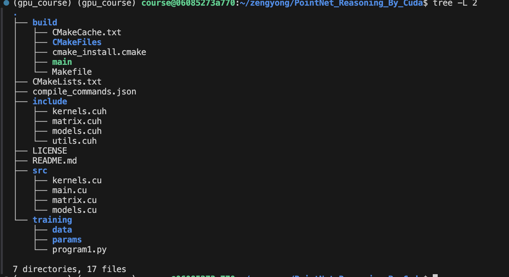

# CUDA 实现PointNet 网络的推理
这是国科大"GPU架构与编程"课程作业，要求用cuda实现对PointNet模型（已提供训练python代码）的推理并实现适当优化。

作业会根据推理时间进行排名，本仓库运行时间为12.6348s, 准确率为0.8,排名68/210。

最优成绩可以到0.0008s,本仓库还有很大优化空间。
## 安装方式
目录结构如下：

在training 路径下有data点云数据集及params模型参数，program1.py是pytorch的训练代码。

```
mkdir build && cd build
cmake ..
make
./main ../training
```
## TODO

- [x] 矩阵乘（包括一维卷积）的优化，主要是共享内存(寄存器优化尝试后效果不大)
- [x] 实现batch并行化  
- [x] 改变矩阵shape 减少转置（尝试后是负优化，还没想明白）
- [ ] 实现训练
- [ ] 更细致的优化（虽然没啥想法）
